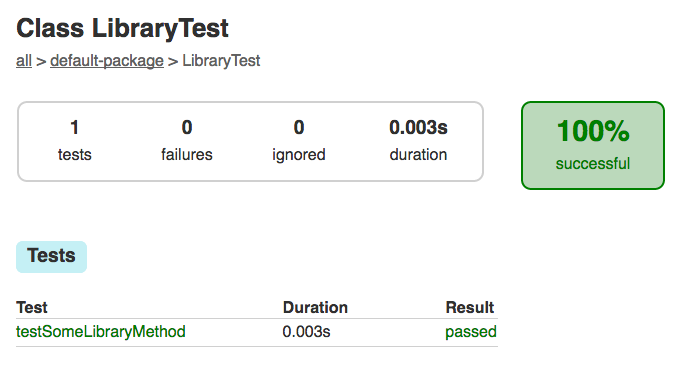

# 构建Java项目

本教程将指导您使用Gradle的 `Init` 插件来生成一个让能其他Jvm库或应用使用的Jvm库。

## 你要构建什么

您将生成具有标准布局的Java库

## 你需要什么

- 大约11分钟
- 文本编辑器或者 IDE （集成开发环境）
- Java运行时环境（JRE）或Java Development Kit（JDK），版本1.8或更高版本（仅运行Gradle时需要）
- Gradle分发版，版本 5.0 或 更高版本

## 创建一个库项目

Gradle 自带了一个 Init 插件。它的文档在这里[Gradle用户手册](https://docs.gradle.org/current/userguide/build_init_plugin.html)。它有一个叫做 `init` 的任务，可以用来生成项目。`init` 任务会去调用 `wrapper` 任务来创建 Gradle Wrapper 脚本 `gradlew`。

第一步是为新项目创建一个文件夹，并将目录进入该文件夹。

```
$ mkdir building-java-libraries
$ cd building-java-libraries
```

## 运行 Init 任务

在新项目目录中，使用 `java-library` 参数运行 `init` 任务。

**If you prefer the Groovy DSL**
```
$ gradle init --type java-library --project-name jvm-library
> Task :wrapper
> Task :init

BUILD SUCCESSFUL in 4s
2 actionable tasks: 2 executed
```

**If you prefer the Kotlin DSL**
```
$ gradle init --type java-library --project-name jvm-library --dsl kotlin
> Task :wrapper
> Task :init

BUILD SUCCESSFUL in 0s
2 actionable tasks: 2 executed
```

 `init` 任务首先执行 `wrapper` 任务来生成 `gradlew` 和 `gradlew.bat` wrapper（包装器）脚本。然后创根据下面的结构来创建项目。

 **Groovy DSL**
 ```
 .
├── build.gradle
├── gradle
│   └── wrapper 
│       ├── gradle-wrapper.jar
│       └── gradle-wrapper.properties
├── gradlew
├── gradlew.bat
├── settings.gradle
└── src
    ├── main
    │   └── java 
    │       └── Library.java
    └── test
        └── java 
            └── LibraryTest.java
```
**Kotlin DSL**
```
├── build.gradle.kts
├── gradle
│   └── wrapper 
│       ├── gradle-wrapper.jar
│       └── gradle-wrapper.properties
├── gradlew
├── gradlew.bat
├── settings.gradle.kts
└── src
    ├── main
    │   └── java 
    │       └── Library.java
    └── test
        └── java 
            └── LibraryTest.java
```

**wrapper** wrapper（包装器）文件的文件夹
**main/java** Java源文件文件夹
**test/java** Java测试文件夹

现在您已经拥有了一个简单Java库项目所需的组件。

## 检查生成的项目文件

生成的 *settings.gradle* （设置文件）被大量注释，但只有一行是有效的:

**生成的 settings.gradle 文件 groocy 版本**
```
/*
 * 这个文件是由Gradle 'init'任务生成的。
 * 设置文件用于指定在根项目中包含哪些子项目。
 */
rootProject.name = 'building-java-libraries' 
```

**生成的 settings.gradle 文件 kotlin 版本**
```
rootProject.name = "building-java-libraries"
```

> 这行代码指定了根项目的名称

生成的 *build.gradle* 文件也被大量注释了，下面是有效的代码副本：

**生成的 build.gradle 文件 groocy 版本**
```
plugins {
    id 'java-library'
}

repositories {
    jcenter() //指定依赖仓库
}

dependencies {
    //这是一个将依赖项导出到使用者的示例，也就是说在使用者的编译类路径中找到依赖项。
    api 'org.apache.commons:commons-math3:3.6.1' 

    //这是一个内部使用的依赖项示例，它没有在自己的编译类路径上公开给使用者。
    implementation 'com.google.guava:guava:26.0-jre' 

    //JUnit测试库
    testImplementation 'junit:junit:4.12' 
}
```

**生成的 build.gradle 文件 kotlin 版本**
```
plugins {
    `java-library`
}

repositories {
    jcenter() 
}

dependencies {
    //这是一个将依赖项导出到使用者的示例，也就是说在使用者的编译类路径中找到依赖项。
    api("org.apache.commons:commons-math3:3.6.1") 

    //这是一个内部使用的依赖项示例，它没有在自己的编译类路径上公开给使用者。
    implementation("com.google.guava:guava:26.0-jre") 

    //JUnit测试库
    testImplementation("junit:junit:4.12") 
}
```

该构建脚本添加了 [java-libaray](https://docs.gradle.org/5.0/userguide/java_library_plugin.html) 插件。它扩展了`java-base` 插件并添加了编译Java源代码任务的。

这是 `src/main/java/jvm/library/Library.java` 的内容。

**生成的 `src/main/java/Library.java`**

```java
package jvm.library;

public class Library {
    public boolean someLibraryMethod() {
        return true;
    }
}
```

生成的JUnit规范， `src/test/java/jvm/library/LibraryTest.java` 的内容。

**生成的 `Generated src/test/java/LibraryTest.java`**
```java
package jvm.library;

import org.junit.Test;
import static org.junit.Assert.*;

public class LibraryTest {
    @Test public void testSomeLibraryMethod() {
        Library classUnderTest = new Library();
        assertTrue("someLibraryMethod should return 'true'", classUnderTest.someLibraryMethod());
    }
}
```

生成的测试类有一个简单的 [JUnit 4] 测试。测试实例化 `libaray` 类，调用`someLibraryMethod`方法，并检查返回值是否为“true”。

## 打包为Jar

构建项目，只需要运行 `build` 任务。你可以使用全局的 `gradle` 命令，但是当一个项目包含了 wrapper （包装器） 脚本。建议使用  `gradlew` 命令比较好。

```bat
$ ./gradlew build
> Task :compileJava
> Task :processResources NO-SOURCE
> Task :classes
> Task :jar
> Task :assemble
> Task :compileTestJava
> Task :processTestResources NO-SOURCE
> Task :testClasses
> Task :test
> Task :check
> Task :build

BUILD SUCCESSFUL in 9s
4 actionable tasks: 4 executed
```

> 你第一次运行 wrapper 脚本的时候，`gradlew` 也许会有一段延时，它会去下载指定的 `gradle` 版本到本地文件夹 `~/.gradle/wrapper/dists`。

第一次运行 build 的时候，Gradle会去检查您你的 `~/.gradle` 目录是否已经有了 Junit 的库和其他的依赖库缓。如果没有，将会下载并缓存到该目录。在你下次运行 build 的时候，这个缓存将会直接被使用而不用重新下载。`build` 任务会编译源文件，运行测试，生成测试报告。

你可以在 `build/reports/tests/test/index.html` 查看HTML格式的测试报告。

下面是一个简单的报告截图：



你可以在 `build/libs` 目录中找到生成名为 `building-java-libraries.jar` 的 Jar 包文件。可以输入下面的命令来验证 jar 文件是否有效。

```bat
$ jar tf build/libs/building-java-libraries.jar
META-INF/
META-INF/MANIFEST.MF
Library.class
```

你会看到必须的文件清单 --`MANIFEST.MF`-- 和编译完成的 `Library` 类。

> 所有这些都不需要在构建脚本中进行任何额外的配置，因为 Gradle 的 `java-library` 插件假定您的项目源安排在 [传统的项目](https://docs.gradle.org/5.0/userguide/java_plugin.html#sec:java_project_layout) 布局中。如果您愿意，可以按照用户手册中的描述 [自定义项目布局](https://docs.gradle.org/5.0/userguide/java_plugin.html#sec:changing_java_project_layout)。

恭喜您，您刚刚完成了创建Java库的第一步!您现在可以根据您自己的项目需要对其进行自定义了。

## 自定义 Jar 配置

你可能最需要的是指定 Jar 文件的 版本。这个在构建脚本中使用顶级 `version` （版本）属性很容易实现，如下：

**build.gradle groovy版本**
```java
version = '0.1.0'
```
**build.gradle kotlin版本**
```java
version = "0.1.0"
```

注意，生成的JAR文件位于 `build/libs/build-java-libraries-0.1.0。jar` 包含预期的版本。

另一个常见的需求是定制清单文件，通常是添加一个或多个属性。让我们 [配置jar任务](https://docs.gradle.org/5.0/userguide/more_about_tasks.html#sec:configuring_tasks) 在清单文件中包含库名和版本。在构建脚本的末尾添加以下内容:

**build.gradle groovy版本**
```java
jar {
    manifest {
        attributes('Implementation-Title': project.name,
                   'Implementation-Version': project.version)
    }
}
```
**build.gradle kotlin版本**
```java
tasks {
    jar {
        manifest {
            attributes(
                mapOf("Implementation-Title" to project.name,
                      "Implementation-Version" to project.version)
            )
        }
    }
}
```

确认这些更改按生效，需要再次运行jar任务，这一次还将从jar中解包清单文件:

```
$ ./gradlew jar
$ jar xf build/libs/building-java-libraries-0.1.0.jar META-INF/MANIFEST.MF
```

现在查看 `META-INF/MANIFEST.MF` 的内容如下:

```js
Manifest-Version: 1.0
Implementation-Title: building-java-libraries
Implementation-Version: 0.1.0
```

> **了解关于配置jar的更多信息**  
> `manifest ` 只是jar任务上可以配置的许多属性之一。有关完整列表，请参见 [Gradle语言参考](https://docs.gradle.org/5.0/dsl/) 的 [Jar部分](https://docs.gradle.org/5.0/dsl/org.gradle.api.tasks.bundling.Jar.html) 以及 [Gradle用户手册](./use) 的 [Jar](https://docs.gradle.org/5.0/userguide/java_plugin.html#sec:jar) 和 [创建归档](https://docs.gradle.org/5.0/userguide/working_with_files.html#sec:archives) 部分。


